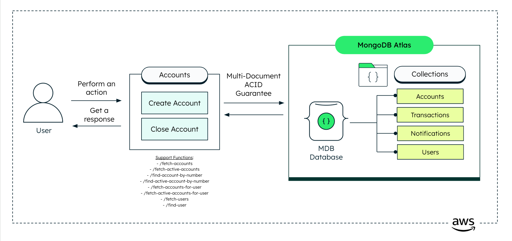

# Leafy Bank Accounts Service (Backend)

This repository powers the backend for Leafy Bank, a demo banking application designed to showcase modern financial services technology. It manages account operations such as opening and closing accounts, utilizing MongoDB to ensure secure and efficient data processing. The backend provides APIs for seamless integration, highlighting the robustness and flexibility of modern banking solutions.

## Where Does MongoDB Shine?

MongoDB excels in managing complex operational data, making it an ideal choice for financial services that require efficient and scalable account management.

## The 4 Pillars of the Document Model

1. **Easy**: [MongoDB's document model](https://www.mongodb.com/resources/basics/databases/document-databases) naturally fits with object-oriented programming, utilizing BSON documents that closely resemble JSON. This design simplifies the management of complex data structures such as user accounts, allowing developers to build features like account creation, retrieval, and updates with greater ease.

2. **Fast**: Following the principle of "Data that is accessed together should be stored together," MongoDB enhances query performance. This approach ensures that related data—like user and account information—can be quickly retrieved, optimizing the speed of operations such as account look-ups or status checks, which is crucial in services demanding real-time access to operational data.

3. **Flexible**: MongoDB's schema flexibility allows account models to evolve with changing business requirements. This adaptability lets financial services update account structures or add features without expensive and disruptive schema migrations, thus avoiding costly downtime often associated with structural changes.

4. **Versatile**: The document model in MongoDB effectively handles a wide variety of data types, such as strings, numbers, booleans, arrays, objects, and even vectors. This versatility empowers applications to manage diverse account-related data, facilitating comprehensive solutions that integrate user, account, and transactional data seamlessly.

## Multi-Document Transaction Guaranteed

MongoDB offers robust support for [multi-document ACID transactions](https://www.mongodb.com/products/capabilities/transactions), essential for maintaining data integrity and consistency across multiple collections. This capability ensures that complex operations—such as linking accounts to users or updating account statuses—are executed reliably, handling updates across different collections with precision.

These attributes emphasize MongoDB's strengths as a powerful choice for developing scalable, efficient, and reliable solutions focused on account management within the financial industry.

## High Level Architecture



## Tech Stack

- [MongoDB Atlas](https://www.mongodb.com/atlas/database) for the database
- [FastAPI](https://fastapi.tiangolo.com/) for the backend framework
- [Pydantic](https://pydantic-docs.helpmanual.io/) for documenting FastAPI Swagger schemas
- [Poetry](https://python-poetry.org/) for dependency management
- [Docker](https://www.docker.com/) for containerization

## Prerequisites

Before you begin, ensure you have met the following requirements:

- MongoDB Atlas account, you can create one [here](https://account.mongodb.com/account/register). Free tier is sufficient for this project.
- Python 3.10 or higher (but less than 3.11)
- Poetry (install via [Poetry's official documentation](https://python-poetry.org/docs/#installation))

## Setup Instructions

### Step 1: Set Up MongoDB Database and Collections

1. Log in to [MongoDB Atlas](https://account.mongodb.com/account/login) and create a new database named `leafy_bank`. You can use another name if you prefer, but make sure to update all database name references in the code and environment variables.
2. Inside this database, create a 4 (four) empty collections:
    - `users`
    - `accounts`
    - `transactions`
    - `notifications`

### Step 2: Add MongoDB User

- Create a new MongoDB user with read and write access to the `leafy_bank` database. You can follow the official MongoDB documentation to create a new user. You can find the instructions [here](https://www.mongodb.com/docs/atlas/security-add-mongodb-users/).

#### From the GUI, you can follow these steps:
1. Access your cluster.
2. Under the `Security` tab, click on `Database Access`.
3. Click on `Add New Database User or User Group`.
4. Fill in the user details and set the password.
5. Under `Database User Privileges` -> `Add Specific Privileges`, select `readWrite` for the `leafy_bank` database, and you can select `*` for all collections.
6. Click on `Add User`.

> **_Note:_** Don't forget to save the username and password. You will need them to connect to the database.

### Add environment variables

> **_Note:_** Create a `.env` file within the `/backend` directory.

```bash
MONGODB_URI = "mongodb+srv://<REPLACE_USERNAME>:<REPLACE_PASSWORD>@<REPLACE_CLUSTER_NAME>.mongodb.net/<REPLACE_DATABASE_NAME>"
ORIGINS=http://localhost:3000
```

## Run it Locally

### Setup virtual environment with Poetry

1. (Optional) Set your project description and author information in the `pyproject.toml` file:
   ```toml
   description = "Your Description"
   authors = ["Your Name <you@example.com>"]
2. Open the project in your preferred IDE.
3. Open a Terminal window.
4. Ensure you are in the root project directory where the `makefile` is located.
5. Execute the following commands:
  - Poetry start
    ````bash
    make poetry_start
    ````
  - Poetry install
    ````bash
    make poetry_install
    ````
6. Verify that the `.venv` folder has been generated within the `/backend` directory.

### Run the Backend

1. To run the backend, execute the following command:
    ````bash
    poetry run uvicorn main:app --host 0.0.0.0 --port 8000
    ````

> **_Note:_** Notice that the backend is running on port `8000`. You can change this port by modifying the `--port` flag.

## Run with Docker

Make sure to run this on the root directory.

1. To run with Docker use the following command:
```
make build
```
2. To delete the container and image run:
```
make clean
```

## API Documentation

You can access the API documentation by visiting the following URL:

```
http://localhost:<PORT_NUMBER>/docs
```
E.g. `http://localhost:8000/docs`

> **_Note:_** Make sure to replace `<PORT_NUMBER>` with the port number you are using and ensure the backend is running.

## Common errors

- Check that you've created an `.env` file that contains the `MONGODB_URI` and `ORIGINS` variables.

## Future tasks

- [ ] Add tests
- [ ] Evaluate SonarQube for code quality
- [ ] Automate the deployment process using GitHub Actions or CodePipeline
- [ ] Improve Pydantic usage for API Request and Response models